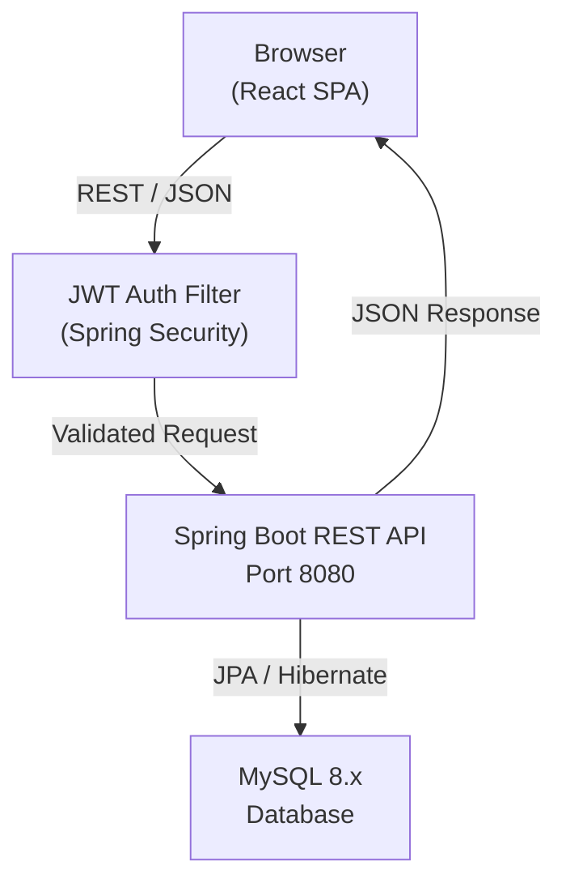
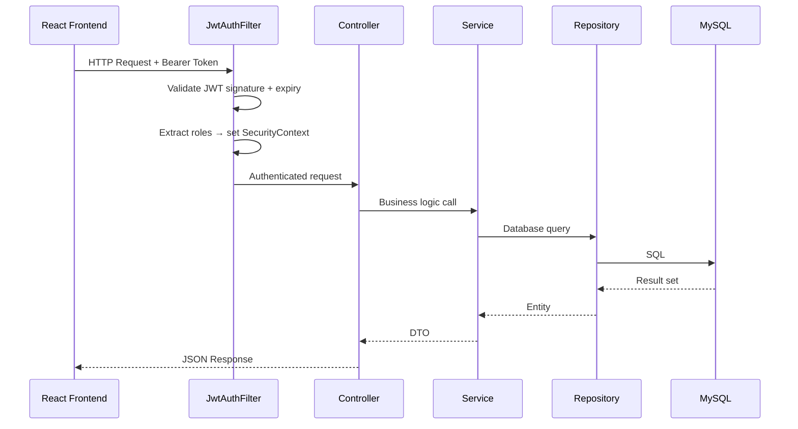
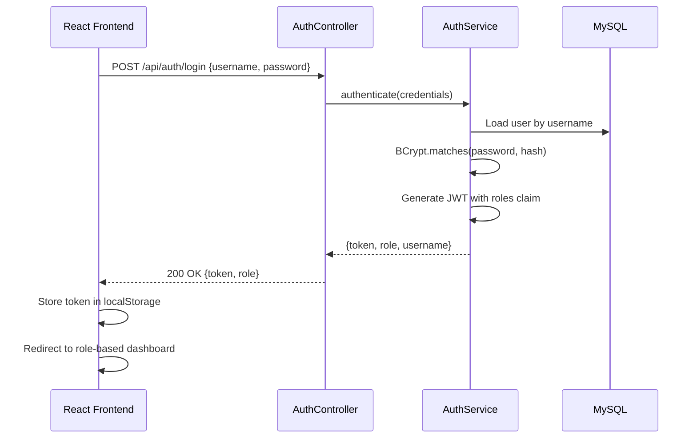
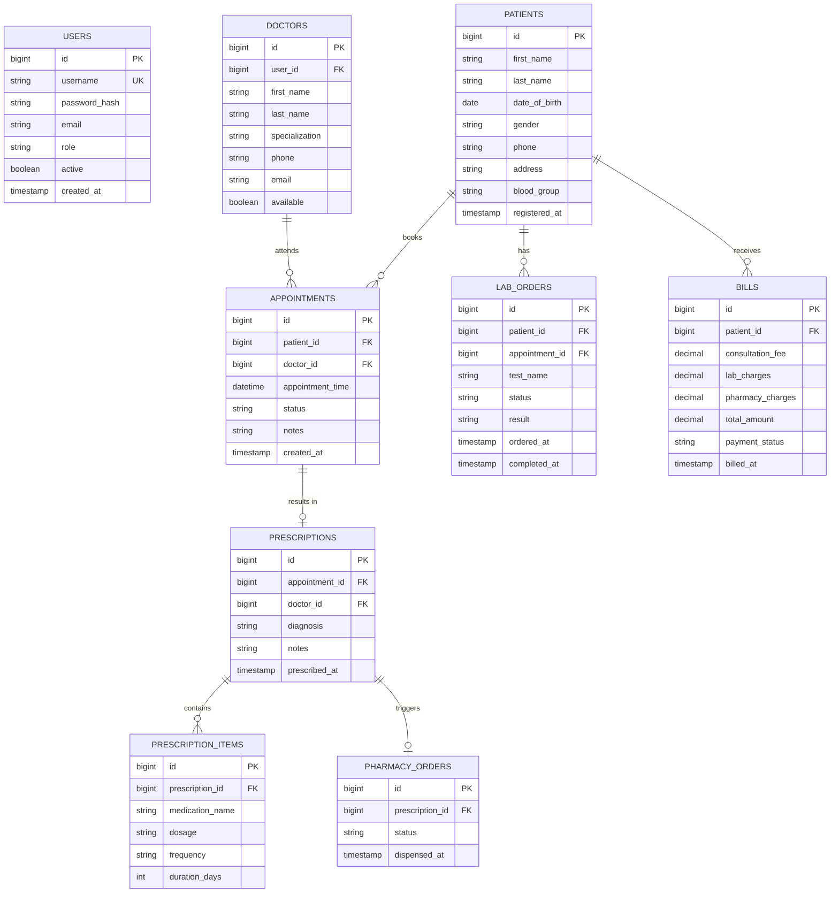

# Hospital Management System

<div align="center">


**Full-stack Hospital Management System — Spring Boot REST API + React frontend with JWT authentication and role-based access control.**

[Features](#features) · [Architecture](#architecture) · [API Docs](#api-documentation) · [Setup](#running-locally) · [Screenshots](#screenshots)

</div>

---

## Overview

The **Hospital Management System (HMS)** is a full-stack web application designed to digitize and streamline hospital operations. It provides a centralized platform for managing patients, doctors, appointments, pharmacy, laboratory, and billing — all secured with JWT-based authentication and role-based access control.

Built as an internship project at **Techmiya Solutions**, it demonstrates production-level full-stack development with a Spring Boot REST backend and a React frontend communicating via a clean RESTful API contract.

**Roles supported:**
- `ADMIN` — Full system access
- `RECEPTIONIST` — Patient registration, appointment scheduling
- `DOCTOR` — View assigned appointments, write prescriptions
- `LAB_TECHNICIAN` — Manage laboratory orders and results
- `PHARMACIST` — Process pharmacy orders

---

## Features

### Core Modules
- **Patient Management** — Registration, profile, medical history
- **Doctor Management** — Doctor profiles, specialization, schedule
- **Appointment Scheduling** — Book, reschedule, cancel appointments with status tracking
- **Prescription Management** — Doctors issue prescriptions linked to appointments
- **Laboratory Management** — Lab orders, test results, report generation
- **Pharmacy Management** — Medication dispensing linked to prescriptions
- **Billing & Invoicing** — Generate and manage patient bills across services

### Security
- JWT stateless authentication (HS256)
- Role-based access control on all API endpoints
- BCrypt password hashing
- Spring Security method-level authorization

### Frontend
- React 18 with React Router for SPA navigation
- Axios for REST API communication
- Role-aware UI rendering (menu and routes differ per role)
- Responsive layout with clean CSS

---

## Architecture

### System Architecture



### Request Lifecycle



### Authentication Flow



---

## Database Design

### ER Diagram



---

## Module Breakdown

| Module | Package | Description |
|---|---|---|
| Auth | `auth` | Login, JWT generation, Spring Security config |
| Patient | `patient` | Patient registration, profile, search |
| Doctor | `doctor` | Doctor management, schedule |
| Appointment | `appointment` | Booking, status management |
| Prescription | `prescription` | Doctor-issued prescriptions and items |
| Laboratory | `lab` | Lab orders and results |
| Pharmacy | `pharmacy` | Medication dispensing |
| Billing | `billing` | Invoice generation and payment tracking |
| Common | `common` | DTOs, exception handling, response wrappers |

---

## Folder Structure

```
hospital-management-system/
├── backend/
│   └── src/main/java/com/pruthvims/hms/
│       ├── auth/
│       │   ├── controller/AuthController.java
│       │   ├── service/AuthService.java
│       │   ├── dto/
│       │   └── security/JwtFilter.java
│       ├── patient/
│       │   ├── controller/PatientController.java
│       │   ├── service/PatientService.java
│       │   ├── model/Patient.java
│       │   └── repository/PatientRepository.java
│       ├── doctor/
│       ├── appointment/
│       ├── prescription/
│       ├── lab/
│       ├── pharmacy/
│       ├── billing/
│       └── common/
│           ├── exception/
│           └── dto/ApiResponse.java
├── frontend/
│   ├── src/
│   │   ├── components/
│   │   ├── pages/
│   │   │   ├── Dashboard.jsx
│   │   │   ├── Patients.jsx
│   │   │   ├── Appointments.jsx
│   │   │   └── ...
│   │   ├── services/     ← Axios API calls
│   │   ├── context/      ← Auth context
│   │   └── App.jsx
│   └── package.json
└── README.md
```

---

## API Documentation

### Authentication

| Method | Endpoint | Description | Auth |
|---|---|---|---|
| `POST` | `/api/auth/login` | Authenticate, returns JWT | No |
| `POST` | `/api/auth/logout` | Invalidate session | Yes |

### Patients

| Method | Endpoint | Description | Role |
|---|---|---|---|
| `GET` | `/api/patients` | List all patients | ADMIN, RECEPTIONIST |
| `POST` | `/api/patients` | Register new patient | RECEPTIONIST |
| `GET` | `/api/patients/{id}` | Get patient profile | ADMIN, RECEPTIONIST, DOCTOR |
| `PUT` | `/api/patients/{id}` | Update patient | RECEPTIONIST |

### Appointments

| Method | Endpoint | Description | Role |
|---|---|---|---|
| `GET` | `/api/appointments` | List appointments | ADMIN, RECEPTIONIST |
| `POST` | `/api/appointments` | Book appointment | RECEPTIONIST |
| `PUT` | `/api/appointments/{id}/status` | Update status | RECEPTIONIST, DOCTOR |
| `GET` | `/api/appointments/doctor/{id}` | Doctor's appointments | DOCTOR |

### Prescriptions

| Method | Endpoint | Description | Role |
|---|---|---|---|
| `POST` | `/api/prescriptions` | Create prescription | DOCTOR |
| `GET` | `/api/prescriptions/{appointmentId}` | Get prescription | DOCTOR, PHARMACIST |

### Laboratory

| Method | Endpoint | Description | Role |
|---|---|---|---|
| `POST` | `/api/lab/orders` | Create lab order | DOCTOR |
| `PUT` | `/api/lab/orders/{id}/result` | Add result | LAB_TECHNICIAN |
| `GET` | `/api/lab/orders/patient/{id}` | Patient lab history | ADMIN, DOCTOR |

### Billing

| Method | Endpoint | Description | Role |
|---|---|---|---|
| `POST` | `/api/billing` | Generate bill | ADMIN |
| `GET` | `/api/billing/patient/{id}` | Patient bills | ADMIN, RECEPTIONIST |
| `PUT` | `/api/billing/{id}/pay` | Mark as paid | ADMIN |

---

## Running Locally

### Prerequisites

- Java 17+
- Maven 3.8+
- Node.js 18+
- MySQL 8.x

### Backend Setup

```bash
# Clone repository
git clone https://github.com/pruthvi-m-s/hospital-management-system.git
cd hospital-management-system/backend

# Configure database in application.yml
# spring.datasource.url=jdbc:mysql://localhost:3306/hms_db
# spring.datasource.username=your_user
# spring.datasource.password=your_password

# Run migrations and start
./mvnw spring-boot:run
```

### Frontend Setup

```bash
cd hospital-management-system/frontend

# Install dependencies
npm install

# Configure API base URL in src/services/api.js
# const BASE_URL = 'http://localhost:8080/api'

# Start development server
npm run dev
```

### Access the application

```
Frontend:  http://localhost:5173
Backend:   http://localhost:8080
```

---

## Environment Variables

### Backend (`application.yml`)

```yaml
spring:
  datasource:
    url: jdbc:mysql://localhost:3306/hms_db
    username: ${DB_USERNAME}
    password: ${DB_PASSWORD}
  jpa:
    hibernate:
      ddl-auto: validate
    show-sql: false

app:
  jwt:
    secret: ${JWT_SECRET}
    expiration-ms: 86400000   # 24 hours
```

---

## Screenshots

> Screenshots demonstrating the running application can be found in the [`docs/screenshots/`](docs/screenshots/) directory.

---

## Security Notes

- All passwords stored as BCrypt hashes — no plaintext credentials exist in the system
- JWT tokens expire after 24 hours
- All API endpoints except `/api/auth/login` require a valid Bearer token
- Role enforcement applied at both the Spring Security filter level and method level

---

## Future Enhancements

| Feature | Priority |
|---|---|
| Flyway database migrations | High |
| Docker + Docker Compose support | High |
| Refresh token implementation | High |
| OpenAPI / Swagger documentation | High |
| Unit and integration tests | Medium |
| Email notifications for appointments | Medium |
| Patient portal (self-service) | Low |

---

## License

This project is licensed under the [MIT License](LICENSE).

---

## Contact

**Pruthvi M S** — Backend Developer · Java · Spring Boot · Full Stack

[](https://www.linkedin.com/in/pruthvi-m-s-55769a1b2)
[](https://github.com/pruthvi-m-s)
[](mailto:pruthvims712@gmail.com)
