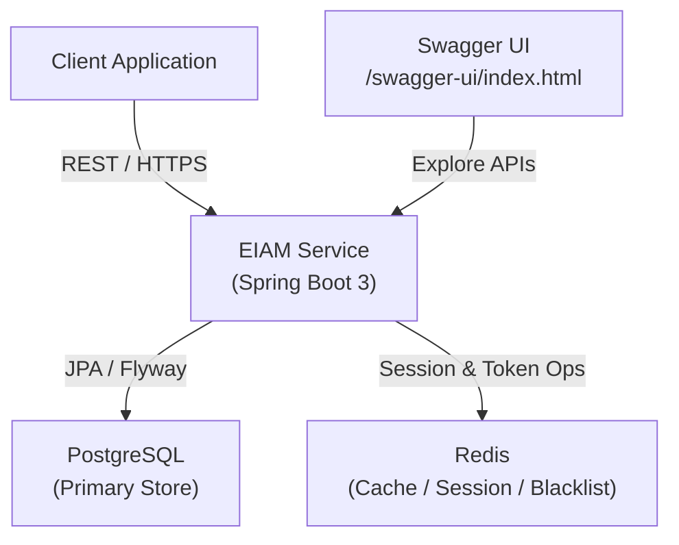
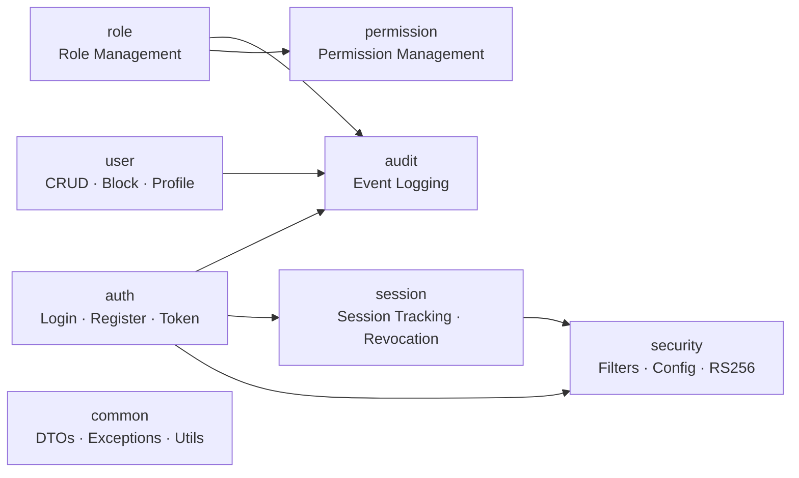
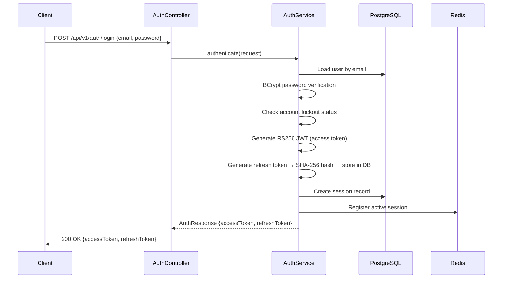
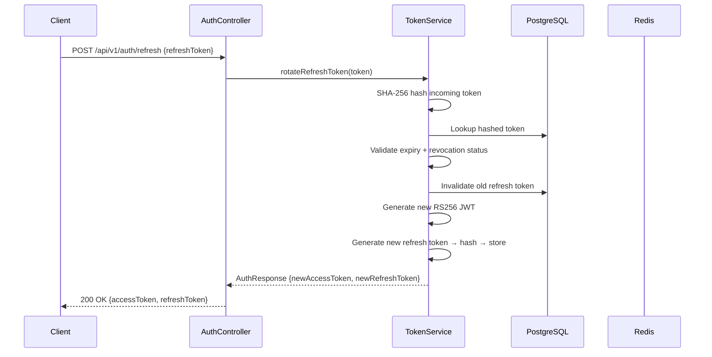
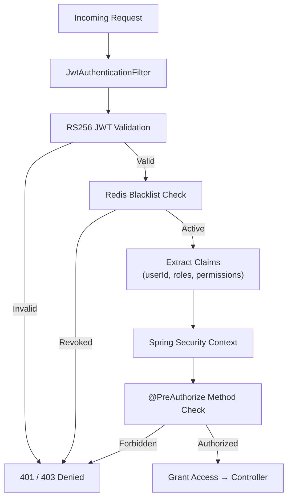
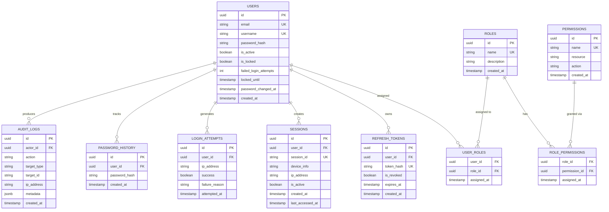

# Enterprise Identity & Access Management Platform

<div align="center">


**Production-grade Identity & Access Management backend built with Java 21 and Spring Boot 3.**

Centralized authentication, RBAC authorization, session governance, audit logging, and token lifecycle management — designed as the security backbone for enterprise applications.

[Features](#features) · [Architecture](#architecture) · [API Docs](#api-documentation) · [Setup](#running-locally) · [Security](#security-design)

</div>

---

## Overview

The **Enterprise Identity & Access Management (EIAM)** platform is a backend security system that centralizes authentication and authorization for modern applications. Built to enterprise standards, it handles the full identity lifecycle — from user registration and login through role assignment, session governance, and audit trails.

It is designed to be integrated as a standalone IAM service backing internal portals, SaaS products, or microservice clusters.

**Core responsibilities:**
- Stateless JWT authentication with RS256 asymmetric signing
- Fine-grained RBAC with role and permission assignment
- Refresh token rotation with SHA-256 server-side hashing
- Redis-backed session revocation and account lockout enforcement
- Full audit trail of all security-relevant operations

---

## Features

### Authentication & Token Management
- User registration with strong password validation
- Secure login with BCrypt credential verification
- **RS256 asymmetric JWT** (access + refresh token pair)
- **Refresh token rotation** — each use issues a new token and invalidates the old
- SHA-256 hashing of raw refresh tokens before DB persistence
- Refresh token revocation (single session and all sessions)
- Redis-backed token blacklist for immediate access token invalidation

### Role-Based Access Control (RBAC)
- Role and Permission entity management
- User-to-role assignment and role-to-permission assignment
- Method-level authorization via `@PreAuthorize`
- Fine-grained endpoint protection

### Session Governance
- Active session tracking per user with device metadata
- Session revocation (single or all sessions) via Redis
- Administrators can inspect and revoke any active session

### Account Security Controls
- Account lockout after configurable failed login attempts
- Password history enforcement (reuse prevention)
- Password expiry enforcement
- Strong password policy validation
- API rate limiting per IP

### Audit Logging
- Login success and failure events
- Password change events
- Role and permission assignment events
- Session revocation events
- User management operations

### Infrastructure
- Flyway database migrations with versioned SQL scripts
- Docker + Docker Compose for local development
- OpenAPI 3 / Swagger UI for interactive API exploration
- Spring Boot Actuator health and readiness endpoints

---

## Architecture

### Architecture Style

**Modular Monolith** — the codebase is organized into domain-oriented modules with clear boundaries, designed to be extracted into microservices if scaling demands it.

### System Architecture



### Module Structure



### Design Principles

- **Domain-Oriented Modules** — each domain owns its entities, services, and controllers
- **Layered Architecture** — Controller → Service → Repository
- **Event-Driven Auditing** — audit events are decoupled from business logic
- **Security-First** — JWT validation, rate limiting, and CORS configured at the filter chain level
- **Stateless Authentication** — no server-side session state; Redis used only for revocation signals
- **Principle of Least Privilege** — roles carry minimum required permissions

---

## Authentication Flow



---

## Token Refresh Flow



---

## Authorization Flow



---

## Database Design

### ER Diagram



---

## Module Breakdown

| Module | Responsibility |
|---|---|
| `auth` | Login, registration, token issuance, refresh, logout |
| `user` | User CRUD, account blocking, admin user management |
| `profile` | User profile reads and updates |
| `role` | Role creation, listing, deletion |
| `permission` | Permission creation, role-permission assignment |
| `session` | Session tracking, active session listing, revocation |
| `audit` | Audit event persistence and retrieval |
| `security` | JWT filter, security config, RS256 key loading, rate limiting |
| `common` | Shared DTOs, exception hierarchy, response wrappers, utils |
| `config` | Application, Redis, OpenAPI, CORS, Actuator configuration |

---

## Folder Structure

```
src/
└── main/
    ├── java/com/pruthvims/eiam/
    │   ├── auth/
    │   │   ├── controller/
    │   │   ├── service/
    │   │   ├── dto/
    │   │   └── model/
    │   ├── user/
    │   │   ├── controller/
    │   │   ├── service/
    │   │   ├── dto/
    │   │   └── model/
    │   ├── role/
    │   ├── permission/
    │   ├── session/
    │   ├── audit/
    │   ├── security/
    │   │   ├── filter/
    │   │   ├── config/
    │   │   └── keys/
    │   ├── common/
    │   │   ├── exception/
    │   │   ├── response/
    │   │   └── util/
    │   └── config/
    └── resources/
        ├── db/migration/        ← Flyway SQL scripts
        ├── keys/                ← RS256 private/public key pair
        └── application.yml
```

---

## API Documentation

> Full interactive documentation available at `http://localhost:8080/swagger-ui/index.html` after startup.
> OpenAPI spec: `http://localhost:8080/v3/api-docs`

### Authentication Endpoints

| Method | Endpoint | Description | Auth Required |
|---|---|---|---|
| `POST` | `/api/v1/auth/register` | Register new user | No |
| `POST` | `/api/v1/auth/login` | Authenticate user, returns token pair | No |
| `POST` | `/api/v1/auth/refresh` | Rotate refresh token, issue new access token | No |
| `POST` | `/api/v1/auth/logout` | Revoke current session and refresh token | Yes |
| `POST` | `/api/v1/auth/logout-all` | Revoke all sessions for current user | Yes |

### User Management Endpoints

| Method | Endpoint | Description | Auth Required |
|---|---|---|---|
| `GET` | `/api/v1/users` | List all users | ADMIN |
| `GET` | `/api/v1/users/{id}` | Get user by ID | ADMIN |
| `PUT` | `/api/v1/users/{id}` | Update user | ADMIN |
| `DELETE` | `/api/v1/users/{id}` | Delete user | ADMIN |
| `POST` | `/api/v1/users/{id}/block` | Block user account | ADMIN |
| `POST` | `/api/v1/users/{id}/unblock` | Unblock user account | ADMIN |
| `PUT` | `/api/v1/users/me/password` | Change own password | Yes |

### Role & Permission Endpoints

| Method | Endpoint | Description | Auth Required |
|---|---|---|---|
| `GET` | `/api/v1/roles` | List all roles | ADMIN |
| `POST` | `/api/v1/roles` | Create role | ADMIN |
| `DELETE` | `/api/v1/roles/{id}` | Delete role | ADMIN |
| `POST` | `/api/v1/roles/{id}/permissions` | Assign permission to role | ADMIN |
| `POST` | `/api/v1/users/{id}/roles` | Assign role to user | ADMIN |
| `GET` | `/api/v1/permissions` | List all permissions | ADMIN |
| `POST` | `/api/v1/permissions` | Create permission | ADMIN |

### Session Endpoints

| Method | Endpoint | Description | Auth Required |
|---|---|---|---|
| `GET` | `/api/v1/sessions/me` | List current user's active sessions | Yes |
| `DELETE` | `/api/v1/sessions/{sessionId}` | Revoke a specific session | Yes |
| `GET` | `/api/v1/sessions` | List all sessions (admin view) | ADMIN |

### Audit Endpoints

| Method | Endpoint | Description | Auth Required |
|---|---|---|---|
| `GET` | `/api/v1/audit` | Query audit log (filterable) | ADMIN |
| `GET` | `/api/v1/audit/{userId}` | Audit trail for specific user | ADMIN |

---

## Environment Variables

Copy `.env.example` to `.env` and configure before running:

```bash
cp .env.example .env
```

| Variable | Description | Example |
|---|---|---|
| `DB_HOST` | PostgreSQL host | `localhost` |
| `DB_PORT` | PostgreSQL port | `5432` |
| `DB_NAME` | Database name | `eiam_db` |
| `DB_USERNAME` | DB username | `eiam_user` |
| `DB_PASSWORD` | DB password | `strongpassword` |
| `REDIS_HOST` | Redis host | `localhost` |
| `REDIS_PORT` | Redis port | `6379` |
| `JWT_ACCESS_EXPIRY_MS` | Access token TTL in milliseconds | `900000` (15 min) |
| `JWT_REFRESH_EXPIRY_MS` | Refresh token TTL in milliseconds | `604800000` (7 days) |
| `RATE_LIMIT_REQUESTS` | Max requests per window | `100` |
| `RATE_LIMIT_WINDOW_MS` | Rate limit window in ms | `60000` |
| `ACTUATOR_USERNAME` | Actuator basic auth user | `actuator` |
| `ACTUATOR_PASSWORD` | Actuator basic auth password | `securepassword` |

### RS256 Key Generation

```bash
# Generate RSA private key
openssl genrsa -out private.pem 2048

# Extract public key
openssl rsa -in private.pem -pubout -out public.pem

# Place both under src/main/resources/keys/
```

---

## Running Locally

### Prerequisites

- Java 21+
- Maven 3.9+
- Docker & Docker Compose

### 1. Clone the repository

```bash
git clone https://github.com/pruthvi-m-s/enterprise-identity-access-management.git
cd enterprise-identity-access-management
```

### 2. Configure environment

```bash
cp .env.example .env
# Edit .env with your preferred values
```

### 3. Start infrastructure (PostgreSQL + Redis)

```bash
docker-compose up -d postgres redis
```

### 4. Run the application

```bash
./mvnw spring-boot:run
```

### 5. Access Swagger UI

```
http://localhost:8080/swagger-ui/index.html
```

---

## Docker Instructions

### Run full stack (app + dependencies)

```bash
docker-compose up -d
```

### Build application image

```bash
docker build -t eiam-service:latest .
```

### docker-compose.yml services

| Service | Port | Description |
|---|---|---|
| `eiam-app` | `8080` | Spring Boot application |
| `postgres` | `5432` | PostgreSQL database |
| `redis` | `6379` | Redis cache |

---

## Health Monitoring

Spring Boot Actuator exposes the following endpoints:

| Endpoint | Description |
|---|---|
| `GET /actuator/health` | Application health summary |
| `GET /actuator/health/liveness` | Kubernetes liveness probe |
| `GET /actuator/health/readiness` | Kubernetes readiness probe |
| `GET /actuator/info` | Application info |

---

## Security Design

### JWT Strategy
- **RS256 asymmetric signing** — private key signs tokens, public key verifies. The verification key can be distributed to downstream services without exposing signing capability.
- **Short-lived access tokens** (15 min default) reduce the blast radius of token theft.
- **Refresh token rotation** — every use invalidates the previous token, preventing replay attacks.
- **SHA-256 hashing** of raw refresh tokens before DB storage — database compromise does not expose usable tokens.

### Redis Role
Redis is the revocation backbone:
- Session IDs are tracked in Redis; logout removes the session key
- Access tokens added to Redis blacklist on logout (TTL = remaining token lifetime)
- Login attempt counters stored in Redis with TTL-based auto-reset
- Account lockout state managed in Redis

### Password Security
- BCrypt with configurable work factor
- Password history table prevents reuse of last N passwords
- Password expiry enforced at login with forced change prompt
- Strong password regex validated at registration and change

### Rate Limiting
- IP-based rate limiting enforced at the filter chain
- Configurable request count and window via environment variables
- Exceeding limits returns `429 Too Many Requests`

---

## Testing

```bash
# Run all tests
./mvnw test

# Run with coverage report
./mvnw verify
```

> Integration tests use Testcontainers (planned). Unit tests cover service layer business logic, token validation, and password policy enforcement.

---

## Performance Considerations

- Redis caches session and blacklist lookups, avoiding DB round-trips on every authenticated request
- Flyway migrations run at startup only; no migration overhead at request time
- JPA second-level cache can be enabled for read-heavy entities (Roles, Permissions)
- Access token validation is stateless (cryptographic verification only) except for blacklist check

---

## Future Enhancements

| Feature | Priority |
|---|---|
| Multi-Factor Authentication (TOTP) | High |
| GitHub Actions CI/CD pipeline | High |
| Testcontainers integration tests | High |
| Prometheus metrics + Grafana dashboards | Medium |
| Postman collection export | Medium |
| SSO / SAML integration | Low |
| LDAP / Active Directory connector | Low |
| Admin dashboard UI | Low |

---

## License

This project is licensed under the [MIT License](LICENSE).

---

## Contact

**Pruthvi M S** — Backend Developer · Java · Spring Boot · Security Engineering

[](https://www.linkedin.com/in/pruthvi-m-s-55769a1b2)
[](https://github.com/pruthvi-m-s)
[](mailto:pruthvims712@gmail.com)
